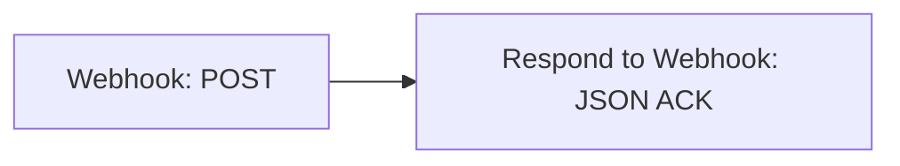

# Connect Message487 to self-hosted n8n

[English](../en/n8n-self-hosted.md) | [Русский](../ru/n8n-self-hosted.md)

Installing on a phone? See [APK installation and Android restrictions](apk-installation.md).

This guide targets Message487 0.0.2 and later, with Bearer authentication. You need the n8n editor and an HTTPS endpoint
reachable from your phone. For a local Android emulator, use the debug build and
[DevServer](../../DevServer/README.md). Release APKs reject HTTP endpoints.

## Prepare your server

For the managed service, use the [n8n Cloud guide](n8n-cloud.md).
This guide is for the owner or administrator of a self-hosted n8n server.

Follow the official [Docker Compose guide](https://docs.n8n.io/deploy/host-n8n/install-options/install-using-docker-compose)
or choose another [installation option](https://docs.n8n.io/deploy/host-n8n/install-options).
Configure persistent storage, backups and a public HTTPS endpoint with a trusted
certificate. It must be reachable from your phone, including over mobile data if
forwarding should work outside your home network.

If someone else manages the server, ask them for editor access and the external
n8n address. The editor password and webhook token are separate settings.
[DevServer](../../DevServer/README.md) is for local development; do not expose it
publicly with its bundled test credentials.

## 1. Create a receiving workflow

Import [receive.json](../../DevServer/workflows/receive.json) using **Import from File**
in the editor menu. It validates basic fields and acknowledges the incoming `event_id`.
Import a separate workflow rather than replacing an existing production workflow.



To configure the same two nodes manually, set **Webhook** as follows:

| Field | Value |
| --- | --- |
| HTTP Method | `POST` |
| Path | A unique path such as `message487/receive-<random-string>` |
| Authentication | `Header Auth` |
| Respond | `Using 'Respond to Webhook' Node` |

Create a **Header Auth** credential: **Name** = `Authorization`, **Value** = `Bearer <token>`.
Generate a private token with `openssl rand -hex 32` and replace `<token>`. Select this
credential in Webhook, including after importing the fixture; do not use the bundled public
DevServer credential in production. The editor login is separate from webhook authentication.
See [official webhook credentials](https://docs.n8n.io/integrations/builtin/credentials/webhook/).

Set **Respond to Webhook → Respond With → JSON**, **Response Code → 200**, and use
this **Expression** in **Response Body**:

```javascript
{{ { status: 'accepted', event_id: $('Webhook').first().json.body.event_id } }}
```

`Webhook` is the trigger node's name; adjust the expression if you rename it.
This minimal manual example does not validate requests. The imported `receive.json`
also validates `schema_version`, `event_id`, `message_type` and `text`, returning
HTTP 400 for invalid input.

The client expects an object, not an array, JSON-encoded string or HTML:

```json
{"status":"accepted","event_id":"the-same-event_id-as-the-request"}
```

The status must be exactly `accepted` and the ID must match. The default n8n response
“Workflow got started” is not an ACK for this client. See the official
[Webhook](https://docs.n8n.io/integrations/builtin/core-nodes/n8n-nodes-base.webhook/) and
[Respond to Webhook](https://docs.n8n.io/integrations/builtin/core-nodes/n8n-nodes-base.respondtowebhook/) documentation.

## 2. Publish and copy the URL

Select **Publish** (or enable **Active** in older n8n versions), then copy the
Webhook node's **Production URL**, for example:

```text
https://n8n.example.org/webhook/message487/receive-<random-string>
```

The `/webhook-test/` **Test URL** is for temporary listening with **Listen for test event**.
Production requests use a published workflow and appear under **Executions**.
Publish again after editing the workflow.

If a reverse proxy causes n8n to display an internal URL, configure `WEBHOOK_URL`,
`N8N_PROXY_HOPS` and forwarded headers using the official
[reverse-proxy guide](https://docs.n8n.io/deploy/host-n8n/configure-n8n/basic-configuration/configuration-examples/configure-webhook-urls-with-reverse-proxy).
Use the final HTTPS URL with a trusted certificate: Message487 does not follow
HTTP redirects or disable TLS verification.

## 3. Configure the app

1. Open **Connection** and paste the complete Production URL.
2. Enter the same token in **Webhook token**, without `Bearer `.
3. Set a recognizable **Device code**, such as `personal-phone`.
4. Keep **n8n confirmation** enabled.
5. Save and send a test event.
6. Open the event in **Journal** and check its acknowledgement and HTTP 200.

After the test succeeds, enable your desired **Sources**. Notifications require
Android notification access and selected apps; SMS requires receive-SMS permission.
Enabling SMS and selecting your SMS app can produce two events for one message.

The bundled emulator endpoint is `http://10.0.2.2:5678/webhook/message487/receive`,
which requires a debug build. On a physical phone, `localhost` means the phone
itself, and `10.0.2.2` is not your computer's address.

## 4. Inspect received data

Open **Executions → execution → Webhook → Output → body** in n8n. Match its
`event_id` with the app journal. Enable saving successful execution data if needed;
DevServer already does this. Execution history contains complete messages, so
configure access and retention accordingly. Request headers may contain the token too.

Example notification body:

```json
{
  "schema_version": 1,
  "event_id": "5d8ee1a5-9360-4b0e-8412-942b2e1c99ab",
  "device_id": "43b55766-95b6-40b8-8f4f-c0240f547914",
  "device_code": "personal-phone",
  "message_type": "notification",
  "occurred_at": "2026-09-09T09:00:00Z",
  "source": "org.example.chat",
  "source_name": "Example Chat",
  "title": "Test notification",
  "text": "Connection check"
}
```

| Field | Meaning |
| --- | --- |
| `event_id` | Event ID, preserved across delivery retries |
| `device_id` | Installation ID |
| `device_code` | Editable device label |
| `message_type` | `test`, `notification` or `sms` |
| `occurred_at` | Event timestamp in ISO 8601 format |
| `source` / `source_name` | Source package / app name; SMS uses source `android` |
| `title` | Notification title; absent for SMS and tests |
| `sender` | SMS sender; absent for notifications and tests |
| `text` | Event text |

Directly after Webhook use `{{ $json.body.text }}` or `{{ $json.body.device_code }}`.
If intermediate nodes replace the data, reference the original node explicitly:
`{{ $('Webhook').first().json.body.text }}`.

## 5. Add message processing

For a complete example, see [forwarding to Telegram](n8n-telegram.md).

The bundled receiver only acknowledges requests; it does not send to Telegram,
store a separate durable queue or deduplicate. Put your actions before Respond to
Webhook, acknowledging only after the operation you consider acceptance succeeds.
For slow processing, persist the event to a durable queue/database first, ACK it,
and perform downstream work separately.

The client uses 10-second connection and read timeouts. A lost response can cause
an already processed request to be retried. Use `event_id` as a unique storage key;
already accepted duplicates must receive the same successful ACK. A separate
“check then insert” without a unique constraint does not prevent concurrent duplicates.

Acknowledging before processing removes the event body from the client's queue
once confirmed. A later n8n failure will not trigger a phone retry. Successful
n8n execution and successful client acknowledgement are different outcomes.

## Test without a phone

Use your actual Production URL and a new ID for each test. This request contains
synthetic data only:

Set `WEBHOOK_TOKEN` in your shell to the same private token before running the command.

```sh
curl --fail-with-body --max-time 10 \
  -X POST 'https://n8n.example.org/webhook/message487/YOUR-PATH' \
  -H 'Content-Type: application/json' \
  -H "Authorization: Bearer ${WEBHOOK_TOKEN:?Set WEBHOOK_TOKEN}" \
  --data '{"schema_version":1,"event_id":"manual-check-001","device_id":"manual-test","device_code":"test-phone","message_type":"test","occurred_at":"2026-09-09T09:00:00Z","source":"life.andre.message487","source_name":"Message487","text":"Synthetic connection test"}'
```

Expect HTTP 200 and `{"status":"accepted","event_id":"manual-check-001"}`.
This checks the server contract; also test the Android connection button and a new
notification or SMS to exercise actual app delivery.

## Troubleshooting

| Symptom | Check |
| --- | --- |
| HTTP 404 | Production URL, publication, POST method and path |
| HTTP 401/403 | Authentication and proxy/n8n access restrictions |
| HTTP 301/302 | Supply the final URL; redirects are not followed |
| `INVALID_ACK` with HTTP 200 | JSON object, `status: accepted`, matching ID and Webhook response mode |
| Timeout/network error | Phone connectivity, TLS, firewall and time until response |
| No execution in the editor | Executions tab and successful execution retention |
| Tests arrive, messages do not | Sources, Android permissions, selected apps and pause state |

Network failures, timeouts, HTTP 408/425/429 and 5xx retry automatically. Invalid ACKs
and other HTTP errors require intervention and manual retry from the journal.
Changing the URL or token only affects new events; queued events retain both original values.
Old queued events created without authentication are blocked and cannot be sent anonymously.
After upgrading from 0.0.1, enter the token and send a new test; delete obsolete blocked events.
Send a new test after fixing configuration and delete old records separately if needed.
The top-bar bug icon opens [diagnostics](diagnostics.md), which records delivery
outcomes without message text.
