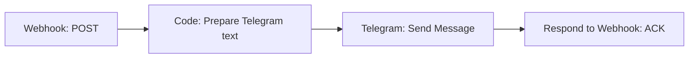

# Forward Message487 notifications to Telegram

[English](../en/n8n-telegram.md) | [Русский](../ru/n8n-telegram.md)

First configure the [n8n webhook](n8n-webhook.md) and confirm a test event. That guide
also links to official documentation, n8n Cloud and self-hosted installation options.
Keep the bot token in **n8n Credentials**; it is not needed in Android. Forwarded
messages are available to the selected Telegram chat and may remain in n8n history.

## 1. Create a bot and credential

1. Open the official [@BotFather](https://t.me/BotFather) in Telegram.
2. Send `/newbot`, then choose a name and username.
3. Save the issued token in a new **Telegram** credential in n8n, in **Access Token**.
   Do not put it in node text, the webhook URL or exported workflow files.
4. Open a private chat with the new bot and press **Start** or send `/start` so it
   can send you messages.

References: [creating bots](https://core.telegram.org/bots/features#botfather) and
[n8n Telegram credentials](https://docs.n8n.io/integrations/builtin/credentials/telegram/).

## 2. Find the chat ID

For a new bot that is not connected to a Telegram Trigger, save this code locally as
`telegram-chat-id.py` and run `python3 telegram-chat-id.py`. It prompts for the token
without echoing it and reads updates without sending messages. Send `/start` to the
bot from your Telegram account before running it.

```python
import getpass
import json
import urllib.error
import urllib.request

bot_token = getpass.getpass('Telegram bot token: ').strip()
request = urllib.request.Request(
    f'https://api.telegram.org/bot{bot_token}/getUpdates',
    data=b'{"timeout":0,"limit":100}',
    headers={'Content-Type': 'application/json'},
)
try:
    with urllib.request.urlopen(request, timeout=10) as response:
        result = json.load(response)
except (urllib.error.URLError, TimeoutError):
    raise SystemExit('Could not read updates; check token, network and existing webhook') from None

chats = {}
for update in result.get('result', []):
    message = update.get('message') or update.get('channel_post') or {}
    chat = message.get('chat') or {}
    if 'id' in chat:
        chats[chat['id']] = chat.get('type', 'unknown')
for chat_id, chat_type in chats.items():
    print(f'chat_id={chat_id} type={chat_type}')
if not chats:
    print('No chats found. Send /start to the bot and run again.')
```

Copy the desired ID into the Telegram node. For a group, add the bot and send
`/start@your_bot_username`, then read the group ID from updates. Preserve any minus
sign. For a public channel, you can use `@channelusername`; add the bot as an
administrator with permission to post messages.

`getUpdates` cannot be used while a Telegram webhook is installed. If the bot is
already connected to Telegram Trigger, read `message.chat.id` from its execution
instead. Do not delete a working bot's webhook just to obtain an ID. This forwarding
workflow does not need Telegram Trigger: its incoming trigger is Webhook.
See [getUpdates](https://core.telegram.org/bots/api#getupdates).

## 3. Build the forwarding chain



Keep **Webhook → Respond → Using 'Respond to Webhook' Node**. If you imported
`receive.json`, remove the direct Webhook → Respond connection and insert Code
and Telegram before Respond. Do not leave another branch acknowledging early.

Add a **Code** node named `Prepare Telegram text`, select **JavaScript** and
**Run Once for All Items**, and paste the contents of:

[telegram-format.js](../../DevServer/telegram-format.js).

The format follows [citadel487-bot](https://github.com/andre487/citadel487-bot/blob/main/sms.go):
the source is bold on the first line. The type, device and date/time are also bold,
each on its own line.
The app name is updated to Message487, and notification titles precede the body.
Example SMS:

Message487: **+79991234567**\
**SMS**\
**personal-phone**\
**09.09.2026 12:30:00**\
Your message

Adjust `timeZone`, `locale` and the labels in `messageTypes` at the top of the script.
The shared script defaults to Russian labels and Moscow time. It uses `occurred_at`,
not the workflow execution time; missing or invalid dates display `—`.
SMS uses the sender as its source; notifications use the app name with the package
identifier as a fallback.

This preserves the complete text by splitting long events into several messages.
It does not split emoji UTF-16 pairs and escapes incoming `<`, `>` and `&` for HTML.
Each part closes its bold tags independently.
The chunk size leaves room for part numbers. Telegram accepts up to 4096 characters
after entity parsing; see [sendMessage](https://core.telegram.org/bots/api#sendmessage).

Configure the **Telegram** node:

| Field | Value |
| --- | --- |
| Credential | Your Telegram credential |
| Resource | `Message` |
| Operation | `Send Message` |
| Chat ID | A fixed ID for your chat, group or channel |
| Text, Expression mode | `{{ $json.telegram_text }}` |
| Additional Fields → Parse Mode | `HTML` |
| Append n8n Attribution | Off |
| Disable WebPage Preview | On if previews are not wanted |

Set Chat ID yourself rather than taking it from the incoming payload. The node
processes each chunk returned by Code. Keep **On Error → Stop Workflow** so a
Telegram error does not turn into a successful ACK. See the official
[Telegram operation reference](https://docs.n8n.io/integrations/builtin/app-nodes/n8n-nodes-base.telegram/message-operations/#send-message).

Set **Respond to Webhook** to JSON and HTTP 200. In Response Body's Expression mode,
reference the original request rather than the Telegram result:

```javascript
{{ { status: 'accepted', event_id: $('Webhook').first().json.body.event_id } }}
```

After Telegram, `$json` contains Telegram's response, so `$json.body.event_id` is
incorrect. If you imported `receive.json`, replace **both Response Body and Response
Code**: both original expressions read `$json.body`. Code already performs basic
validation before sending in this chain. Publish the workflow again.

## 4. Verify delivery

1. Enable n8n confirmation in Message487 and send a test event.
2. Confirm that Telegram receives a message with type `test`.
3. Check the n8n execution, successful Telegram operation and client ACK.
4. Enable notifications, grant access and select a source app.
5. Create a new notification and match it to the execution using `event_id`.

The chain also accepts SMS and tests. To forward only notifications, add an **If**
node after Webhook: `{{ $json.body.message_type }}` equals `notification`. Route true
to Code → Telegram → Respond and false to a separate Respond with the same ACK.
Filtered events must still be acknowledged or they remain in the client's queue.

Do not select Telegram as a notification source on the phone receiving your bot's
messages: that can create a Telegram → Message487 → n8n → Telegram loop. Excluding
Telegram from selected apps is the simplest way to prevent it.

## Errors and retries

| Error | Check |
| --- | --- |
| `chat not found` | Chat ID, private chat started, bot added to group/channel |
| `bot was blocked` / HTTP 403 | Unblock the bot or restore its permissions |
| `can't parse entities` | HTML mode and the supplied escaping; do not use Markdown for this template |
| HTTP 429 | Telegram limits; reduce frequency and honor `retry_after` |
| Message arrives but the client retries | ACK event ID and time until webhook response |

If sending all chunks exceeds the client's timeout, persist the event to a durable
queue first, acknowledge receipt and send to Telegram in a separate workflow.
Do not add a long wait before ACK.

This simple example does not deduplicate. If Telegram accepted a message but ACK
was lost, retrying creates a duplicate; a failed chunk may cause earlier chunks to
repeat too. For more resilient processing, persist `event_id` and per-part progress.
Even that cannot guarantee exactly-once delivery if a crash occurs between Telegram's
response and recording the result; account for this in your retry design.
