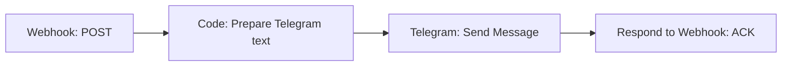

# Пересылка уведомлений из Message487 в Telegram

[English](../en/n8n-telegram.md) | [Русский](../ru/n8n-telegram.md)

Сначала настройте [приём webhook в n8n](n8n-webhook.md) и проверьте тестовое событие.
Там же есть ссылки на официальную документацию, n8n Cloud и самостоятельную установку.
Telegram-токен хранится в **Credentials n8n**; в Android-приложение его вводить не нужно.
Сообщения будут доступны выбранному Telegram-чату и могут сохраняться в истории n8n.

## 1. Создайте бота и credential

1. В Telegram откройте официального [@BotFather](https://t.me/BotFather).
2. Отправьте `/newbot` и задайте имя и username бота.
3. Сохраните выданный токен в новом credential типа **Telegram** в n8n, поле
   **Access Token**. Не вставляйте токен в текст узла, webhook URL или экспорт workflow.
4. Откройте личный чат с новым ботом и нажмите **Start** либо отправьте `/start`.
   Это нужно, чтобы бот мог писать вам.

Справка: [создание бота](https://core.telegram.org/bots/features#botfather),
[Telegram credentials в n8n](https://docs.n8n.io/integrations/builtin/credentials/telegram/).

## 2. Узнайте chat_id

Для нового бота, к которому ещё не подключён Telegram Trigger, сохраните следующий
код в локальный файл `telegram-chat-id.py` и запустите `python3 telegram-chat-id.py`.
Он запросит токен скрытым вводом и прочитает входящие обновления, не отправляя сообщений.
Перед запуском отправьте боту `/start` со своего Telegram-аккаунта.

```python
import getpass
import json
import urllib.error
import urllib.request

bot_token = getpass.getpass('Telegram bot token: ').strip()
request = urllib.request.Request(
    f'https://api.telegram.org/bot{bot_token}/getUpdates',
    data=b'{"timeout":0,"limit":100}',
    headers={'Content-Type': 'application/json'},
)
try:
    with urllib.request.urlopen(request, timeout=10) as response:
        result = json.load(response)
except (urllib.error.URLError, TimeoutError):
    raise SystemExit('Could not read updates; check token, network and existing webhook') from None

chats = {}
for update in result.get('result', []):
    message = update.get('message') or update.get('channel_post') or {}
    chat = message.get('chat') or {}
    if 'id' in chat:
        chats[chat['id']] = chat.get('type', 'unknown')
for chat_id, chat_type in chats.items():
    print(f'chat_id={chat_id} type={chat_type}')
if not chats:
    print('No chats found. Send /start to the bot and run again.')
```

Скопируйте ID нужного чата в настройку узла Telegram. Для группы добавьте бота в
группу, отправьте `/start@имя_бота` и возьмите ID группы из обновлений; сохраняйте
знак минус, если он есть. Для публичного канала можно использовать `@username`
канала, добавив бота администратором с правом публикации сообщений.

`getUpdates` несовместим с уже установленным webhook Telegram. Если этот бот
используется в Telegram Trigger, возьмите `message.chat.id` из входных данных
его execution. Не удаляйте webhook работающего бота ради получения ID.
Для отправки из Message487 **Telegram Trigger не нужен**: входной триггер — Webhook.
Официальная справка: [getUpdates](https://core.telegram.org/bots/api#getupdates).

## 3. Соберите цепочку отправки



В Webhook оставьте **Respond → Using 'Respond to Webhook' Node**. Если вы
импортировали `receive.json`, удалите прямое соединение Webhook → Respond и
вставьте Code и Telegram перед Respond. Не оставляйте параллельный путь, который
подтвердит событие раньше отправки.

Добавьте узел **Code**, имя `Prepare Telegram text`, язык **JavaScript**, режим
**Run Once for All Items**, и вставьте:

```javascript
const event = $('Webhook').first().json.body;
if (!event || event.schema_version !== 1 ||
    typeof event.event_id !== 'string' || !event.event_id ||
    !['test', 'notification', 'sms'].includes(event.message_type) ||
    typeof event.text !== 'string') {
  throw new Error('Invalid Message487 event');
}

const text = [
  `Устройство: ${event.device_code || event.device_id || '—'}`,
  `Источник: ${event.source_name || event.source || '—'}`,
  `Тип: ${event.message_type}`,
  event.title ? `Заголовок: ${event.title}` : '',
  event.sender ? `Отправитель: ${event.sender}` : '',
  event.text,
].filter(line => line !== '').join('\n');

const chunks = [];
let chunk = '';
for (const character of text) {
  if (chunk.length + character.length > 3500) {
    chunks.push(chunk);
    chunk = '';
  }
  chunk += character;
}
if (chunk) chunks.push(chunk);
const escapeHtml = value => value.replace(/[&<>]/g, character => ({
  '&': '&amp;', '<': '&lt;', '>': '&gt;',
})[character]);
return chunks.map((part, index) => ({
  json: {
    telegram_text: escapeHtml(chunks.length > 1
      ? `[${index + 1}/${chunks.length}]\n${part}` : part),
  },
}));
```

Код сохраняет полный текст, разделяя длинное событие на несколько сообщений.
Эмодзи не разрезаются внутри UTF-16-пары; `<`, `>` и `&` экранируются для HTML.
Запас по длине оставлен под номер части. Telegram допускает до 4096 символов
после разбора entities; см. [sendMessage](https://core.telegram.org/bots/api#sendmessage).

Настройте узел **Telegram**:

| Поле | Значение |
| --- | --- |
| Credential | Созданный Telegram credential |
| Resource | `Message` |
| Operation | `Send Message` |
| Chat ID | Постоянный ID вашего чата, группы или канала |
| Text, режим Expression | `{{ $json.telegram_text }}` |
| Additional Fields → Parse Mode | `HTML` |
| Append n8n Attribution | Выключить |
| Disable WebPage Preview | Включить, если не нужны превью ссылок |

Chat ID задайте сами, не берите его из входящего запроса. Узел обработает каждую
часть, которую вернул Code. Оставьте **On Error → Stop Workflow**, чтобы ошибка
Telegram не превратилась в успешное подтверждение. Настройки операции описаны
в [официальной документации узла Telegram](https://docs.n8n.io/integrations/builtin/app-nodes/n8n-nodes-base.telegram/message-operations/#send-message).

В **Respond to Webhook** выберите JSON и HTTP 200. В режиме Expression для
Response Body используйте исходный запрос, а не результат узла Telegram:

```javascript
{{ { status: 'accepted', event_id: $('Webhook').first().json.body.event_id } }}
```

После узла Telegram `$json` содержит ответ Telegram, поэтому `$json.body.event_id`
здесь не подходит. Если импортировали `receive.json`, замените **и Response Body,
и Response Code**: старые выражения в обоих полях обращаются к `$json.body`.
Базовая валидация в этой цепочке уже выполнена в Code до отправки.

Опубликуйте workflow повторно.

## 4. Проверьте доставку

1. В Message487 включите подтверждение n8n и отправьте тестовое событие.
2. Убедитесь, что в Telegram пришло сообщение с типом `test`.
3. В n8n проверьте execution и успешное выполнение Telegram, а в приложении — ACK.
4. Включите уведомления, выдайте доступ и выберите нужное приложение-источник.
5. Создайте новое уведомление и сопоставьте его с execution по `event_id`.

Эта цепочка принимает также SMS и тесты. Если нужны только уведомления, добавьте
после Webhook узел **If** с условием `{{ $json.body.message_type }}` равным
`notification`. Ветку true направьте в Code → Telegram → Respond, а false —
в отдельный Respond с тем же ACK: отфильтрованное событие должно быть подтверждено,
иначе оно останется в очереди клиента.

Не выбирайте Telegram источником уведомлений в Message487, когда этот же телефон
получает сообщения вашего бота: это может создать цикл «Telegram → Message487 →
n8n → Telegram». Проще исключить Telegram целиком из выбранных приложений.

## Ошибки и повторы

| Ошибка | Что проверить |
| --- | --- |
| `chat not found` | Chat ID; начат ли личный диалог; добавлен ли бот в группу/канал |
| `bot was blocked` / HTTP 403 | Разблокируйте бота или восстановите его права |
| `can't parse entities` | Parse Mode HTML и приведённое экранирование; не используйте Markdown для этого шаблона |
| HTTP 429 | Ограничение Telegram; уменьшите частоту, учитывайте `retry_after` |
| Сообщение пришло, но клиент повторяет запрос | Правильный `event_id` в ACK и время ответа webhook |

Если отправка всех частей не успевает до таймаута клиента, сначала сохраняйте
событие в надёжную очередь, подтверждайте приём и выполняйте Telegram-отправку
отдельным workflow. Не добавляйте длинное ожидание перед ACK.

В простом примере нет дедупликации. Если Telegram принял сообщение, а ACK потерялся,
повтор создаст дубль; при ошибке одной из частей могут повториться и предыдущие.
Для устойчивой обработки храните `event_id` и прогресс отправки частей в БД.
Даже это не гарантирует ровно одну отправку при сбое между ответом Telegram и
фиксацией результата — учитывайте этот случай в своей схеме повторов.
