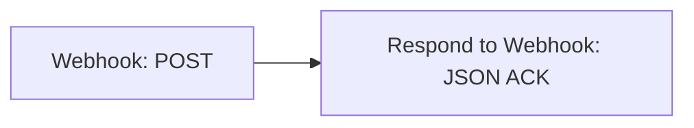

# Как подключить Message487 к n8n

[English](../en/n8n-webhook.md) | [Русский](../ru/n8n-webhook.md)

Инструкция для Message487 0.0.2 и новее, с Bearer-авторизацией. Нужен доступ к редактору n8n и HTTPS-адрес,
доступный с телефона. Для локального Android-эмулятора используйте debug-сборку и
[готовый DevServer](../../DevServer/README.md). Релизный APK не принимает HTTP-адреса.

## Где запустить n8n

- [Официальная документация n8n](https://docs.n8n.io/) — узлы, выражения и работа с workflow.
- [n8n Cloud: начало работы](https://docs.n8n.io/deploy/use-n8n-cloud/start-your-free-trial) — облачная версия без установки сервера.
- [Облако или собственный сервер](https://docs.n8n.io/choose-how-to-use-n8n) — сравнение вариантов запуска.
- [Самостоятельная установка](https://docs.n8n.io/deploy/host-n8n/install-options) — варианты развёртывания.
- [Установка с Docker Compose](https://docs.n8n.io/deploy/host-n8n/install-options/install-using-docker-compose) — официальная инструкция.

Для n8n Cloud используйте HTTPS Production URL своего workspace. Для собственного
сервера настройте доступ по HTTPS, хранение данных и резервные копии.
[DevServer](../../DevServer/README.md) предназначен для локальной разработки,
а не для публикации в интернете с его тестовыми учётными данными.

## 1. Создайте принимающий workflow

Быстрее всего импортировать [receive.json](../../DevServer/workflows/receive.json)
через **Import from File** в меню редактора n8n. Это готовый пример приёмника с
проверкой базовых полей и подтверждением `event_id`. Импортируйте его как отдельный
workflow; не заменяйте им рабочий сценарий с вашими действиями.

В импортированном workflow уже соединены два узла:



Для ручной настройки создайте те же узлы. В узле **Webhook** установите:

| Поле | Значение |
| --- | --- |
| HTTP Method | `POST` |
| Path | Уникальный путь, например `message487/receive-<случайная-строка>` |
| Authentication | `Header Auth` |
| Respond | `Using 'Respond to Webhook' Node` |

Создайте credential **Header Auth**: **Name** = `Authorization`, **Value** = `Bearer <токен>`.
Сгенерируйте собственный токен командой `openssl rand -hex 32`, замените `<токен>`
и выберите credential в Webhook, в том числе после импорта файла. Публичный тестовый
credential DevServer нельзя использовать на рабочем сервере. Пароль редактора n8n
не заменяет авторизацию веб-хука. См. [официальную документацию](https://docs.n8n.io/integrations/builtin/credentials/webhook/).

В узле **Respond to Webhook** выберите **Respond With → JSON**, добавьте
**Response Code → 200**, а **Response Body** переключите в режим **Expression**:

```javascript
{{ { status: 'accepted', event_id: $('Webhook').first().json.body.event_id } }}
```

Здесь `Webhook` — имя первого узла; при переименовании исправьте ссылку в выражении.
Этот минимальный ручной пример подтверждает запрос без валидации. Импортированный
`receive.json` дополнительно проверяет `schema_version`, `event_id`, `message_type`
и `text` и возвращает HTTP 400 для некорректного тела.

Клиент ждёт JSON-объект следующего вида, а не массив, строку с JSON или HTML:

```json
{"status":"accepted","event_id":"тот-же-event_id-что-в-запросе"}
```

`status` должен быть ровно `accepted`, а `event_id` — совпадать с запросом.
Обычный ответ n8n «Workflow got started» не подходит для режима подтверждения.
Настройки узлов описаны в документации [Webhook](https://docs.n8n.io/integrations/builtin/core-nodes/n8n-nodes-base.webhook/)
и [Respond to Webhook](https://docs.n8n.io/integrations/builtin/core-nodes/n8n-nodes-base.respondtowebhook/).

## 2. Опубликуйте workflow и скопируйте URL

Нажмите **Publish** (в более старых версиях n8n — включите **Active**). В узле
Webhook скопируйте **Production URL**, например:

```text
https://n8n.example.org/webhook/message487/receive-<случайная-строка>
```

Не используйте постоянным адресом **Test URL** с `/webhook-test/`: он предназначен
для временного прослушивания через **Listen for test event**. Production URL
работает для опубликованного workflow, а его вызовы смотрят во вкладке **Executions**.
После изменения workflow опубликуйте изменения повторно.

Если n8n стоит за reverse proxy и показывает внутренний адрес, настройте внешний
`WEBHOOK_URL`, число доверенных proxy в `N8N_PROXY_HOPS` и forwarded-заголовки по
[инструкции n8n для reverse proxy](https://docs.n8n.io/deploy/host-n8n/configure-n8n/basic-configuration/configuration-examples/configure-webhook-urls-with-reverse-proxy).
Телефон должен обращаться сразу к конечному HTTPS URL с доверенным сертификатом:
Message487 не следует HTTP-перенаправлениям и не отключает проверку TLS.

## 3. Настройте приложение

1. Откройте **Подключение / Connection**.
2. Вставьте полный Production URL в поле веб-хука.
3. Введите тот же токен в **Токен веб-хука**, без `Bearer `.
4. Задайте понятный **Код устройства / Device code**, например `personal-phone`.
5. Оставьте включённым **Подтверждение n8n / n8n confirmation**.
6. Нажмите кнопку сохранения и отправки тестового события.
7. В **Журнале / Journal** откройте событие и проверьте подтверждение и HTTP 200.

После успешного теста включите нужные источники в **Источниках / Sources**:
для уведомлений выдайте системный доступ и выберите приложения; для SMS выдайте
разрешение на получение SMS. Если выбраны и SMS, и уведомления SMS-приложения,
одно входящее SMS может породить два разных события.

Для эмулятора готовый DevServer использует
`http://10.0.2.2:5678/webhook/message487/receive`. Такой URL допустим только в
debug-сборке. На физическом телефоне `localhost` обозначает сам телефон, а
`10.0.2.2` не является адресом вашего компьютера.

## 4. Посмотрите полученные данные

В n8n откройте **Executions → нужный запуск → Webhook → Output → body**. Найдите
`event_id` из журнала приложения. Для сохранения успешных запусков включите
соответствующую настройку сохранения execution data; в DevServer она уже включена.
История n8n содержит полные сообщения, поэтому настройте её срок хранения и доступ.

Пример тела уведомления:

```json
{
  "schema_version": 1,
  "event_id": "5d8ee1a5-9360-4b0e-8412-942b2e1c99ab",
  "device_id": "43b55766-95b6-40b8-8f4f-c0240f547914",
  "device_code": "personal-phone",
  "message_type": "notification",
  "occurred_at": "2026-09-09T09:00:00Z",
  "source": "org.example.chat",
  "source_name": "Example Chat",
  "title": "Тестовое уведомление",
  "text": "Проверка подключения"
}
```

| Поле | Значение |
| --- | --- |
| `event_id` | ID события; сохраняется при повторах доставки |
| `device_id` | ID установки приложения |
| `device_code` | Редактируемая метка устройства |
| `message_type` | `test`, `notification` или `sms` |
| `occurred_at` | Время события в формате ISO 8601 |
| `source` / `source_name` | Пакет источника / имя приложения; для SMS источник `android` |
| `title` | Заголовок уведомления; отсутствует у SMS и теста |
| `sender` | Отправитель SMS; отсутствует у уведомления и теста |
| `text` | Текст события |

В узле сразу после Webhook доступны выражения `{{ $json.body.text }}` и
`{{ $json.body.device_code }}`. Если промежуточный узел меняет данные, обращайтесь
к исходному событию явно: `{{ $('Webhook').first().json.body.text }}`.

## 5. Добавьте обработку сообщения

Готовый пошаговый сценарий: [пересылка уведомлений в Telegram](n8n-telegram.md).


Готовый приёмник только подтверждает входящий запрос: он не отправляет сообщение
в Telegram, не сохраняет его в отдельную очередь и не удаляет дубли.

Добавьте нужные действия перед Respond to Webhook и отправляйте ACK после
успешного завершения того действия, которое хотите считать приёмом сообщения.
Для долгой обработки сначала надёжно сохраните событие в собственной очереди или
БД, затем верните ACK, а последующие действия выполняйте отдельно.

Клиент использует 10-секундные таймауты подключения и чтения. Если ответ потерян,
он может повторить уже обработанный запрос. Используйте `event_id` как уникальный
ключ в хранилище; уже принятый дубль должен получить тот же успешный ACK.
Отдельные операции «проверить наличие → добавить» без уникального ограничения не
защищают от двух одновременных запросов.

Если отправить ACK **до** обработки, приложение удалит тело события из своей
очереди после подтверждения. Последующая ошибка в n8n не вызовет повтор на телефоне.
Статус успешного execution в n8n и успешное подтверждение клиенту — разные вещи.

## Проверка без телефона

Следующий запрос содержит только синтетические данные. Подставьте свой Production
URL и при каждом новом тесте используйте новый `event_id`:

Перед запуском задайте в оболочке переменную `WEBHOOK_TOKEN` с тем же секретным токеном.

```sh
curl --fail-with-body --max-time 10 \
  -X POST 'https://n8n.example.org/webhook/message487/ВАШ-ПУТЬ' \
  -H 'Content-Type: application/json' \
  -H "Authorization: Bearer ${WEBHOOK_TOKEN:?Set WEBHOOK_TOKEN}" \
  --data '{"schema_version":1,"event_id":"manual-check-001","device_id":"manual-test","device_code":"test-phone","message_type":"test","occurred_at":"2026-09-09T09:00:00Z","source":"life.andre.message487","source_name":"Message487","text":"Synthetic connection test"}'
```

Ожидаемый ответ: `{"status":"accepted","event_id":"manual-check-001"}` с HTTP 200.
Это проверяет серверный контракт; реальную доставку из Android проверьте кнопкой
тестового события и затем новым уведомлением или SMS.

## Если доставка не работает

| Симптом | Что проверить |
| --- | --- |
| HTTP 404 | Production URL, публикацию workflow, метод POST и путь |
| HTTP 401/403 | Настройки авторизации и ограничения доступа на proxy/n8n |
| HTTP 301/302 | Укажите конечный URL: клиент не следует redirect |
| `INVALID_ACK` при HTTP 200 | JSON-объект, `status: accepted`, точное совпадение `event_id`, режим ответа Webhook |
| Таймаут / сетевая ошибка | Доступность адреса с телефона, TLS, firewall, время до ответа |
| Нет execution в редакторе | Откройте вкладку Executions, проверьте сохранение успешных запусков |
| Тест проходит, а сообщений нет | Источники, разрешения Android, выбор приложений и паузу пересылки |

Сетевые ошибки, таймауты, HTTP 408/425/429 и 5xx приводят к автоматическим повторам.
Неверный ACK и прочие HTTP-ошибки требуют вмешательства и ручного повтора из журнала.
Изменение URL в настройках влияет только на **новые** события: уже поставленные
в очередь сохраняют прежний адрес. После исправления подключения отправьте новый
тест; старые записи при необходимости удалите отдельно.

Для разбора ошибок откройте значок диагностики в верхней панели приложения.
[Диагностический лог](diagnostics.md) показывает исход доставки без текста сообщений.

Токен хранится на устройстве зашифрованным. Смена URL или токена применяется только
к новым событиям: очередь сохраняет исходные значения. Старые события без токена
блокируются. После обновления с 0.0.1 введите токен, отправьте новый тест и удалите
ненужные заблокированные события. История n8n может сохранять заголовки с токеном;
ограничьте доступ и срок хранения.
